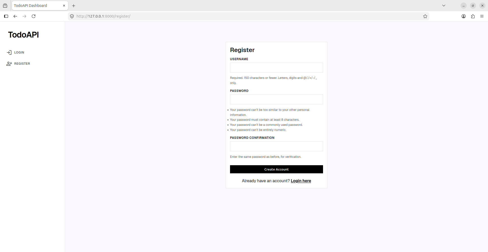
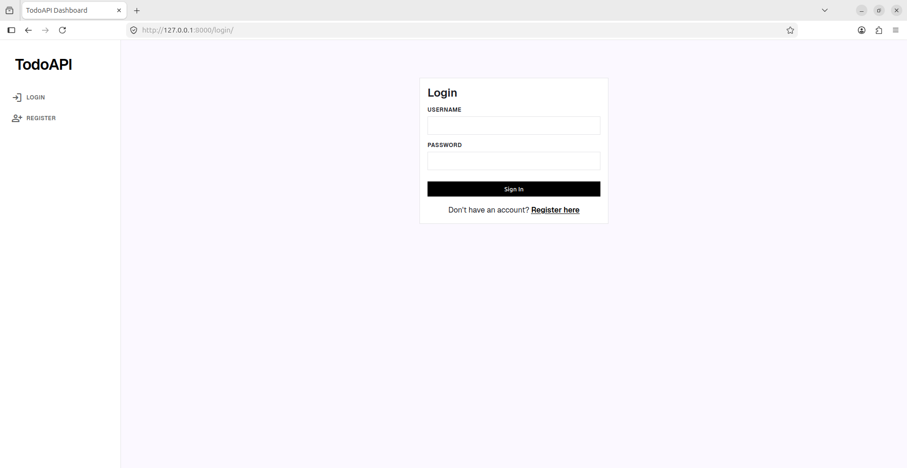
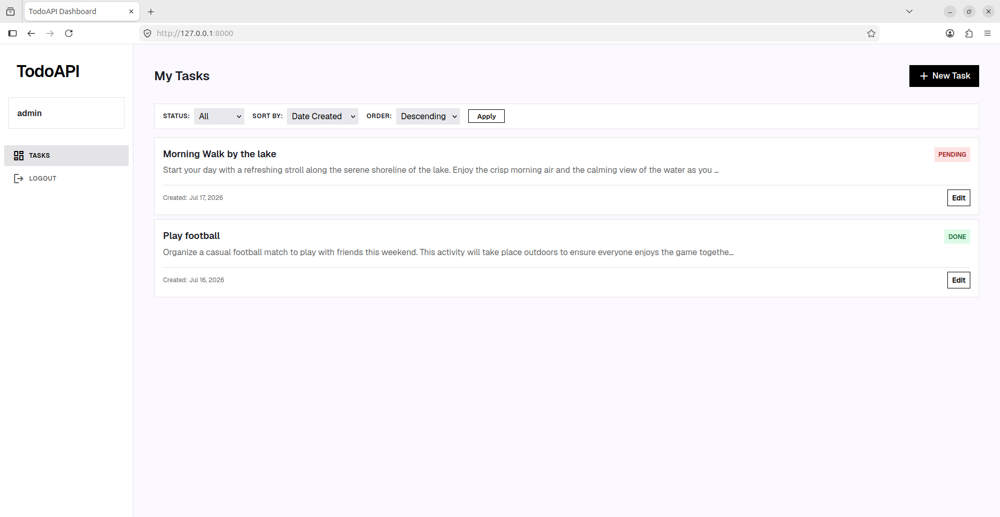
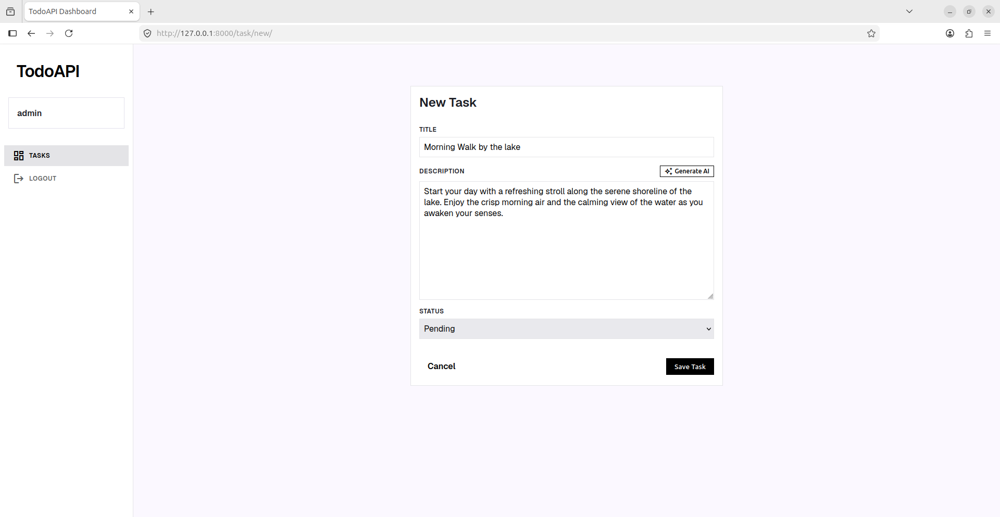
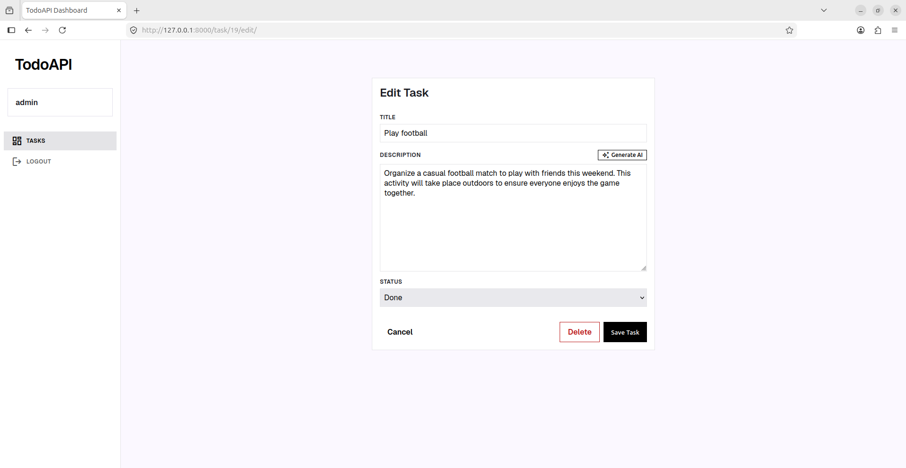

# To-Do App & API

## Overview
This project is a full-stack To-Do application featuring a web frontend built with Django Templates and a RESTful API built with Django REST Framework (DRF). 

The frontend provides a user-friendly web interface for managing tasks, while the backend API offers full CRUD operations, JWT-based user authentication, strict validation rules, and uniform JSON response formatting. The application uses PostgreSQL as its database.

## Screenshots

Here is a look at the web interface:

| View / State | Description | Clickable Preview |
|--------------|-------------|-------------------|
| **1. Register** | User registration form to create a new account. | <a href="public/screenshots/register.png"></a> |
| **2. Login** | User login form to authenticate and obtain JWT token. | <a href="public/screenshots/login.png"></a> |
| **3. List Tasks** | Main dashboard view displaying all user tasks with status filtering. | <a href="public/screenshots/list_task.png"></a> |
| **4. Create Task** | View/form where users can create a new task. | <a href="public/screenshots/create_task.png"></a> |
| **5. Edit Task** | View to edit/update an existing task's title, description, and status. | <a href="public/screenshots/edit_task.png"></a> |


## Setup Instructions

The easiest and recommended way to run the project is using Docker.

1. **Clone the repository:**
   ```bash
   git clone https://github.com/rangonroyutsab/todoapi.git
   cd todoapi
   ```

2. **Configure Environment Variables:**
   Ensure your `.env` file in the root directory is populated with your database and Django credentials. (You can copy from `.env.example`):
   ```ini
   POSTGRES_DB=taskdb
   POSTGRES_USER=postgres
   POSTGRES_PASSWORD=change_me_to_a_strong_password
   POSTGRES_HOST=127.0.0.1
   POSTGRES_PORT=5432
   
   DJANGO_SECRET_KEY=your_secret_key
   DJANGO_DEBUG=True
   DJANGO_ALLOWED_HOSTS=localhost,127.0.0.1
   GEMINI_API_KEY=your_gemini_api_key_here
   ```

3. **Run with Docker Compose:**
   ```bash
   docker-compose up -d --build
   ```
   The API will be available at `http://localhost:8000/`. Docker will automatically handle the PostgreSQL database creation and run Django migrations on startup.

## Endpoints Reference

| Method | Path | Purpose | Auth Required |
|--------|------|---------|---------------|
| `POST` | `/api/v1/register/` | Register a new user. | No |
| `POST` | `/api/v1/login/` | Obtain JWT access & refresh tokens. | No |
| `GET`  | `/api/v1/tasks/` | Retrieve a paginated, sortable list of tasks. | Yes |
| `POST` | `/api/v1/tasks/` | Create a new task. | Yes |
| `GET`  | `/api/v1/tasks/<id>/` | Retrieve a specific task by its ID. | Yes |
| `PUT`  | `/api/v1/tasks/<id>/` | Partially update a specific task by its ID. | Yes |
| `DELETE`| `/api/v1/tasks/<id>/` | Delete a specific task by its ID. | Yes |
| `POST` | `/api/v1/tasks/<id>/generate-description/` | Generate an AI description for a task using Gemini. | Yes |

## Rate Limiting (Throttling)
The API implements rate limiting to prevent abuse:
- **Anonymous Users**: 100 requests per day.
- **Authenticated Users**: 1,000 requests per day.
- **AI Description Generation**: 10 requests per minute and 500 requests per day per user.

## cURL Examples

### 1. Register a User
```bash
curl -X POST "http://127.0.0.1:8000/api/v1/register/" \
     -H "Content-Type: application/json" \
     -d '{"username": "testuser", "email": "test@example.com", "password": "mypassword123"}'
```

### 2. Login (Get Token)
```bash
curl -X POST "http://127.0.0.1:8000/api/v1/login/" \
     -H "Content-Type: application/json" \
     -d '{"username": "testuser", "password": "mypassword123"}'
```
*Note: Copy the `access` token returned here to use in the `Authorization` header for the next requests.*

### 3. Create a new task
```bash
curl -X POST "http://127.0.0.1:8000/api/v1/tasks/" \
     -H "Authorization: Bearer <YOUR_ACCESS_TOKEN>" \
     -H "Content-Type: application/json" \
     -d '{"title": "Buy groceries", "description": "Milk, Eggs, Bread"}'
```

### 4. View all tasks (with filters & pagination)
```bash
curl -X GET "http://127.0.0.1:8000/api/v1/tasks/?status=pending&page=1&limit=5&sort_by=created_at&order=desc" \
     -H "Authorization: Bearer <YOUR_ACCESS_TOKEN>"
```

### 5. Update task by ID 
```bash
curl -X PUT "http://127.0.0.1:8000/api/v1/tasks/1/" \
     -H "Authorization: Bearer <YOUR_ACCESS_TOKEN>" \
     -H "Content-Type: application/json" \
     -d '{"title":"Walk in the lake with my dog", "status": "done"}'
```

### 6. Delete task by ID
```bash
curl -X DELETE "http://127.0.0.1:8000/api/v1/tasks/1/" \
     -H "Authorization: Bearer <YOUR_ACCESS_TOKEN>"
```

### 7. Generate Task Description (AI)
```bash
curl -X POST "http://127.0.0.1:8000/api/v1/tasks/1/generate-description/" \
     -H "Authorization: Bearer <YOUR_ACCESS_TOKEN>"
```

## Response Format
The API follows a standardized response format for both successes and errors.

**Success Response:**
```json
{
  "success": true,
  "message": "Tasks retrieved successfully",
  "data": [
    {
      "id": 1,
      "title": "Buy groceries",
      "description": "Milk, Eggs, Bread",
      "status": "pending",
      "created_at": "2023-10-01T12:00:00Z",
      "updated_at": "2023-10-01T12:00:00Z"
    }
  ],
  "meta": {
    "page": 1,
    "limit": 5,
    "total": 1,
    "totalPages": 1
  }
}
```
*(Note: The `meta` block is only included in list responses).*

**Error Response:**
```json
{
  "success": false,
  "message": "Validation Error",
  "errors": {
    "title": [
      "This field may not be blank."
    ]
  }
}
```
